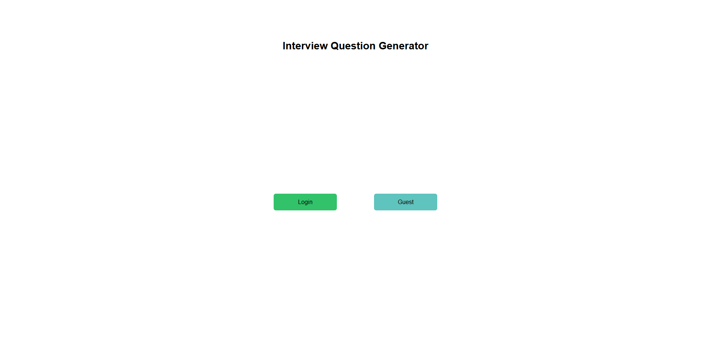
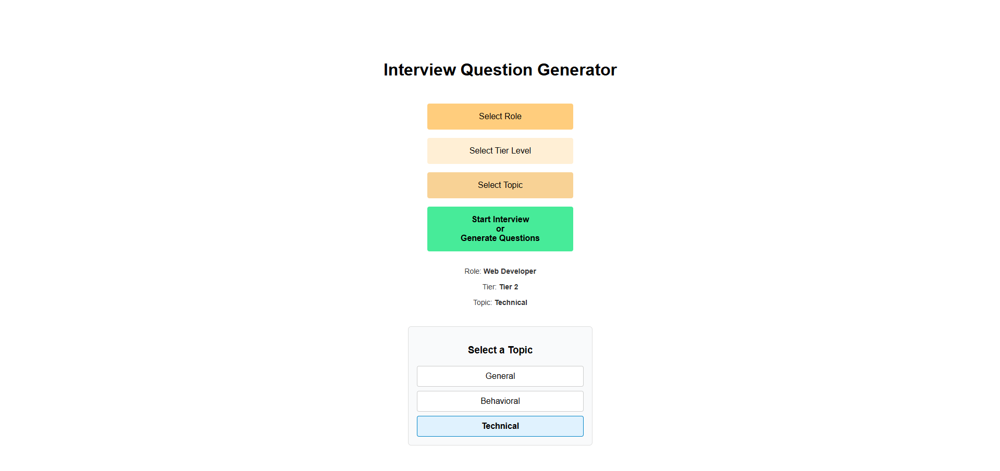
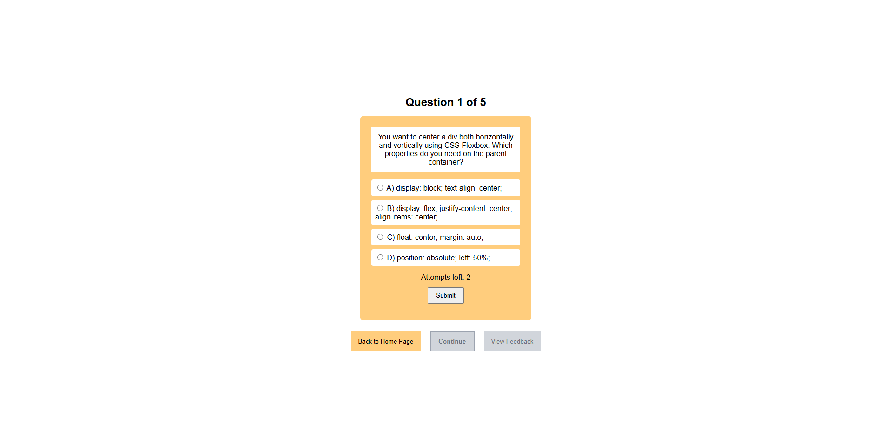
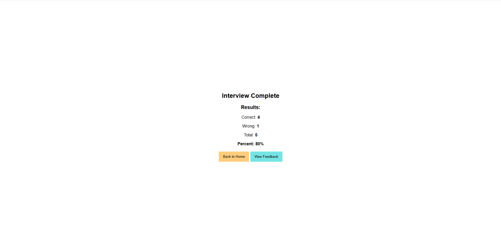
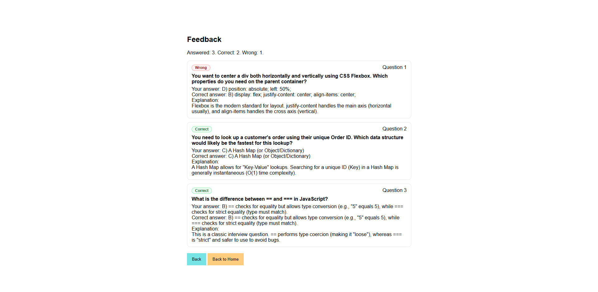

# Interview Question Generator

## Overview
We built this project to help users practice interview questions in a structured way.
The app lets users select a role, tier and topic then runs a short interview session
with immediate feedback and a final score summary.

## Features
- Landing Page with Login or Guest verification
- Role / Tier / Topic selection
- Interview session featuring flashcards with multiple choice questions
- Two attempts per question
- Feedback for questions immediately
- Final results screen with correct, wrong and total percent
- Feedback screen showing current answered questions and explanations

## Screenshots

### Landing Page


### Selection Screen


### Interview Screen


### Results Screen


### Feedback Screen


## Running the Project

### Prerequisites
- Python 3.11+
- pip

### Running the Project

### Deployed version
- Open in browser:
- https://v59-tier1-team-01.onrender.com

### Local Run
1. Clone the repo:
   ```bash
   git clone https://github.com/windwalker46/V59-tier1-team-01.git
   cd V59-tier1-team-01

2. Install requirements:
   ```bash
   pip install -r backend/requirements.txt

3. Start the app:
   ```bash
   python backend/app.py

4. Open:
   - http://127.0.0.1:5000

## Requirements
- See requirements.txt

## Team Documents

- [Team Project Ideas](./docs/team_project_ideas.md)
- [Team Decision Log](./docs/team_decision_log.md)

Meeting Agenda templates (located in the `/docs` directory in this repo):

- Meeting - Voyage Kickoff --> ./docs/meeting-voyage_kickoff.docx
- Meeting - App Vision & Feature Planning --> ./docs/meeting-vision_and_feature_planning.docx
- Meeting - Sprint Retrospective, Review, and Planning --> ./docs/meeting-sprint_retrospective_review_and_planning.docx
- Meeting - Sprint Open Topic Session --> ./docs/meeting-sprint_open_topic_session.docx

## Our Team

Everyone on your team should add their name along with a link to their GitHub
& optionally their LinkedIn profiles below. Do this in Sprint #1 to validate
your repo access and to practice PR'ing with your team *before* you start
coding!

- Teammate Ben Tran #1: [GitHub](https://github.com/windwalker46) / [LinkedIn](https://www.linkedin.com/in/bentran4606/)
- Teammate Rajneesh Kaur #2: [GitHub](https://github.com/rajneeshkaur19) / [LinkedIn](https://www.linkedin.com/in/rajneesh-k-892173339/)

   ...
- Teammate name #n: [GitHub](https://github.com/ghaccountname) / [LinkedIn](https://linkedin.com/in/liaccountname)
